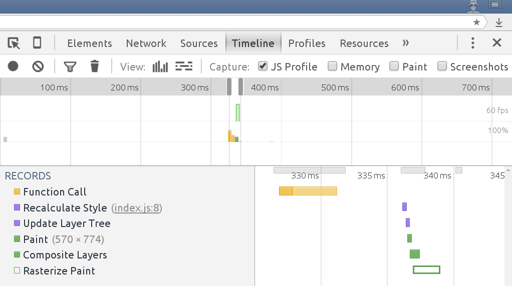
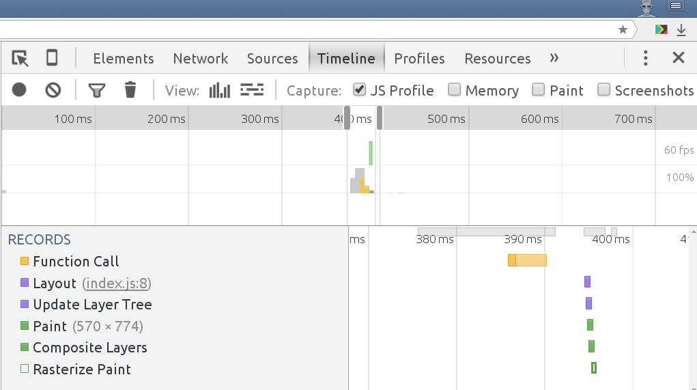
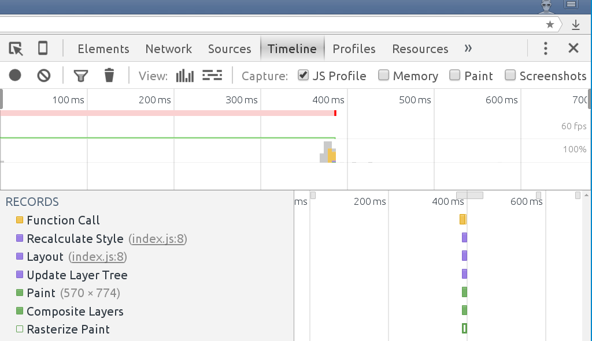

- 🍋 - Scripting
- 🔵 - Loading
- 🍏 - Painting
- 🍆 - Rendering

**TL;DR**
- Bytes → characters → tokens → nodes → object model.
- HTML markup is transformed into a Document Object Model (DOM); CSS markup is transformed into a CSS Object Model (CSSOM).
- DOM and CSSOM are independent data structures.

## Document Object Model (DOM)

## CSS Object Model (CSSOM)

## Repaint

## Reflow

## Reflow and Repaint

**Want a definitive list of which CSS properties trigger layout, paint, or composite?** Check out [CSS Triggers](https://csstriggers.com/).

## Events

- **Parse HTML**. Document Object Model construction (DOM)
   - **Recalculate Style**. CSS Object Model Construction (CSSOM). By default, CSS is treated as
    a render blocking resource, which means that the browser won't render any processed content until the 
    CSSOM is constructed

- **Paint**
   - **Layout**. Render Tree construction, position and size calculation
   - **Paint**. Convert Render Tree to pixels on the screen

## Vocabulary

- FOUC - Flash of Unstyled Content
- jank - is any stuttering, juddering or just plain halting that users see when a site or app isn't keeping up with the refresh rate

## Resources
- [Constructing the Object Model](https://developers.google.com/web/fundamentals/performance/critical-rendering-path/constructing-the-object-model)
- [Rendering: repaint, reflow/relayout, restyle](http://www.phpied.com/rendering-repaint-reflowrelayout-restyle/)
- [Render-tree Construction, Layout, and Paint](https://developers.google.com/web/fundamentals/performance/critical-rendering-path/render-tree-construction)
- [Jankfree](http://jankfree.org/)
- [Use only transform and opacity for animation](https://aerotwist.com/blog/flip-your-animations/)
- [about:tracing — Chrome’s lower-level Tracing tool](https://docs.google.com/presentation/d/1Lq2DD28CGa7bxawVH_2OcmyiTiBn74dvC6vn2essroY/edit#slide=id.g1a504e63c9_2_84)

## CSS Performance

[will-change](https://developer.mozilla.org/en/docs/Web/CSS/will-change) - The will-change CSS property provides a way for authors to hint browsers about the kind of changes to be expected on an element, so that the browser can set up appropriate optimizations ahead of time before the element is actually changed. These kind of optimizations can increase the responsiveness of a page by doing potentially expensive work ahead of time before they are actually required

[contain](https://developer.mozilla.org/en-US/docs/Web/CSS/contain) - The contain property allows an author to indicate that an element and its contents are, as much as possible, independent of the rest of the document tree. This allows the browser to recalculate layout, style, paint, size, or any combination of them for a limited area of the DOM and not the entire page. This property is useful on pages that contain a lot of widgets that are all independent as it can be used to prevent one widget's CSS rules from changing other things on the page.

[pointer-events: none](https://www.thecssninja.com/css/pointer-events-60fps) -  Allow avoiding unnecessary paints through disabling hover effects as the user scrolls

## Strategies

- [PRPL](https://developers.google.com/web/fundamentals/performance/prpl-pattern/)

## Tools

- [Lighthouse](https://developers.google.com/web/tools/lighthouse/)
